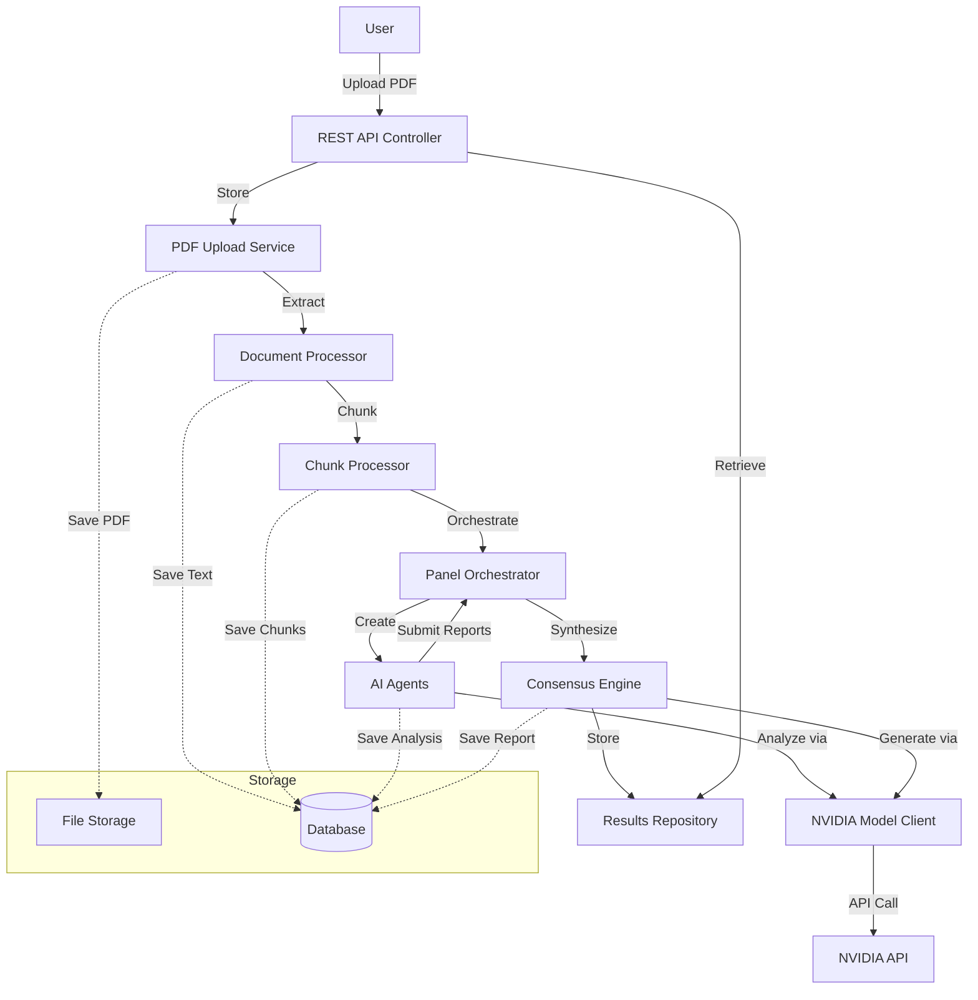

# Design Document: AI Panelist System

## Overview

The AI Panelist System is a Java Spring Boot application that orchestrates multi-agent AI analysis of research documents. The system accepts PDF uploads, extracts and intelligently chunks text content, distributes analysis tasks to specialized AI agents powered by NVIDIA models, and synthesizes individual analyses into a consensus report.

The architecture follows a microservices-inspired design within a monolithic Spring Boot application, with clear separation of concerns across document processing, agent orchestration, AI model integration, and consensus generation. The system handles documents of varying sizes through intelligent chunking and sequential processing, ensuring comprehensive analysis even for large research papers that exceed model context windows.

Key architectural principles:
- Asynchronous processing for long-running AI analysis tasks
- Resilient error handling with retry mechanisms
- Stateful tracking of document processing stages
- Modular agent system supporting multiple specialized analysis types
- Docker containerization for consistent deployment

## Architecture

### High-Level Architecture



### Component Architecture

The system is organized into the following major components:

1. **API Layer**: REST controllers exposing upload, status, and retrieval endpoints
2. **Document Processing Layer**: PDF upload, text extraction, and chunking services
3. **Orchestration Layer**: Panel orchestrator managing agent lifecycle and coordination
4. **Agent Layer**: Specialized AI agents performing independent analysis
5. **Integration Layer**: NVIDIA model client handling external API communication
6. **Consensus Layer**: Synthesis engine generating unified panel reports
7. **Persistence Layer**: Repositories for documents, chunks, analyses, and reports
8. **Configuration Layer**: Spring configuration, Docker setup, and environment management

### Processing Flow

1. User uploads PDF via REST API
2. PDF Upload Service validates and stores file
3. Document Processor extracts text content
4. Chunk Processor divides large documents into manageable chunks
5. Panel Orchestrator creates 6 specialized AI agents
6. Each agent processes chunks sequentially with context carryover
7. Agents submit individual Analysis Reports
8. Consensus Engine synthesizes reports into unified output
9. User retrieves results via REST API

### Asynchronous Processing Model

Document analysis is inherently long-running (potentially 30+ minutes for large documents). The system uses Spring's `@Async` support with a dedicated thread pool:

- Upload returns immediately with document ID
- Analysis runs asynchronously in background
- Status endpoint provides real-time progress updates
- Results endpoint returns completed analysis or current status

## Components and Interfaces

### 1. REST API Controller

**Responsibility**: Expose HTTP endpoints for document upload, status checking, and results retrieval.

**Endpoints**:
- `POST /api/documents/upload` - Upload PDF file
- `GET /api/documents/{documentId}/status` - Get processing status
- `GET /api/documents/{documentId}/results` - Get consensus report
- `GET /api/documents/{documentId}/results/detailed` - Get all individual reports plus consensus

**Dependencies**: PDFUploadService, DocumentStatusService, ResultsService

### 2. PDF Upload Service

**Responsibility**: Validate, store, and manage uploaded PDF files.

**Interface**:
```java
public interface PDFUploadService {
    DocumentUploadResponse uploadDocument(MultipartFile file) throws InvalidFileException;
    boolean validatePDF(MultipartFile file);
    Path storeFile(MultipartFile file, String documentId);
}
```

**Validation Rules**:
- File size ≤ 50MB
- MIME type = application/pdf
- Valid PDF structure (using Apache PDFBox validation)

**Storage**: Files stored in mounted volume at `/app/data/uploads/{documentId}.pdf`

### 3. Document Processor

**Responsibility**: Extract text content from PDF files and prepare for analysis.

**Interface**:
```java
public interface DocumentProcessor {
    ExtractedDocument extractText(String documentId, Path pdfPath) throws ExtractionException;
    int calculateTokenCount(String text);
    boolean preservesReadingOrder(String extractedText);
}
```

**Implementation Details**:
- Uses Apache PDFBox for text extraction
- Preserves logical reading order through PDFBox's `PDFTextStripper`
- Calculates token count using approximate tokenization (1 token ≈ 4 characters for English text)
- Stores extracted text in database with document metadata
- Maximum document size: 500 pages or 1,000,000 tokens

### 4. Chunk Processor

**Responsibility**: Divide large documents into chunks that fit within model context windows.

**Interface**:
```java
public interface ChunkProcessor {
    List<DocumentChunk> chunkDocument(ExtractedDocument document);
    List<SemanticBoundary> identifyBoundaries(String text);
    DocumentChunk createChunk(String text, int sequence, int totalChunks);
}
```

**Chunking Strategy**:
- Target chunk size: 100,000 tokens (leaves 28K token buffer in 128K context window)
- Overlap: 500 tokens between consecutive chunks
- Boundary priority: Section headers > Paragraph breaks > Sentence endings
- Metadata per chunk: sequence number, total count, byte offsets, token count

**Semantic Boundary Detection**:
- Section headers: Lines matching patterns like "# ", "## ", "Introduction", "Methods", etc.
- Paragraph breaks: Double newlines or significant whitespace
- Sentence endings: Period followed by space and capital letter

### 5. Panel Orchestrator

**Responsibility**: Create and coordinate multiple AI agents for document analysis.

**Interface**:
```java
public interface PanelOrchestrator {
    AnalysisPanel createPanel(String documentId);
    void orchestrateAnalysis(AnalysisPanel panel, List<DocumentChunk> chunks);
    List<AnalysisReport> collectReports(AnalysisPanel panel);
    void handleAgentFailure(String agentId, Exception error);
}
```

**Panel Composition**:
- 1 Lead Analyst Agent
- 1 General Analyst Agent
- 1 Methodology Reviewer Agent
- 1 Literature Reviewer Agent
- 1 Quick Screener Agent
- 1 Fact Extractor Agent

**Orchestration Logic**:
- Agents run in parallel (6 concurrent threads)
- Each agent processes chunks sequentially
- Orchestrator waits for all agents to complete
- Failed agents are noted but don't block consensus generation

### 6. AI Agent (Abstract Base + Specializations)

**Responsibility**: Analyze document content and generate specialized reports.

**Base Interface**:
```java
public abstract class AIAgent {
    protected String agentId;
    protected AgentType type;
    protected NVIDIAModelClient modelClient;
    
    public abstract AnalysisReport analyze(List<DocumentChunk> chunks);
    protected abstract String getSystemPrompt();
    protected ChunkAnalysis analyzeChunk(DocumentChunk chunk, List<ChunkAnalysis> previousAnalyses);
    protected AnalysisReport synthesizeChunkAnalyses(List<ChunkAnalysis> chunkAnalyses);
}
```

**Specializations**:
- `LeadAnalystAgent`: Deep critical analysis, research validity, overall quality
- `GeneralAnalystAgent`: Comprehensive review of all aspects
- `MethodologyReviewerAgent`: Research methods, statistics, data analysis
- `LiteratureReviewerAgent`: Citations, theoretical framework, related work
- `QuickScreenerAgent`: Initial screening, key claims, focused analysis
- `FactExtractorAgent`: Key facts, data points, structured summaries

**Multi-Chunk Processing**:
1. Process chunks sequentially (chunk 1, then 2, then 3, etc.)
2. For chunk N, include summary of findings from chunks 1 to N-1 in prompt
3. After all chunks processed, synthesize into unified Analysis Report
4. Synthesis resolves contradictions and identifies cross-chunk themes

**Retry Logic**:
- Per-chunk retry: 3 attempts with exponential backoff (1s, 2s, 4s)
- If chunk fails after retries, note gap and continue with remaining chunks
- Target: 5 minutes per chunk

### 7. NVIDIA Model Client

**Responsibility**: Handle communication with NVIDIA model APIs.

**Interface**:
```java
public interface NVIDIAModelClient {
    ModelResponse sendRequest(ModelRequest request) throws APIException;
    boolean isAvailable();
    void configureRateLimiting(int requestsPerMinute);
}
```

**Configuration**:
- Model: nvidia/llama-3.1-nemotron-70b-instruct
- API endpoint: Configured via environment variable `NVIDIA_API_ENDPOINT`
- Authentication: API key from environment variable `NVIDIA_API_KEY`
- Connection pooling: Max 10 concurrent connections
- Rate limiting: Configurable, default 60 requests/minute

**Error Handling**:
- Retry on 5xx errors: 3 attempts with exponential backoff
- Rate limit (429): Wait and retry based on Retry-After header
- 4xx errors: Return descriptive error to caller
- Network errors: Retry with backoff

### 8. Consensus Engine

**Responsibility**: Synthesize individual agent reports into unified consensus.

**Interface**:
```java
public interface ConsensusEngine {
    ConsensusReport generateConsensus(List<AnalysisReport> agentReports, String documentId);
    List<Theme> identifyCommonThemes(List<AnalysisReport> reports);
    List<Agreement> findAgreements(List<AnalysisReport> reports);
    List<Disagreement> findDisagreements(List<AnalysisReport> reports);
}
```

**Synthesis Process**:
1. Collect all agent Analysis Reports
2. Use nvidia/llama-3.1-nemotron-70b-instruct to identify themes, agreements, disagreements
3. Generate unified recommendations
4. Attribute insights to source agent types
5. Store Consensus Report with document ID
6. Target completion: 2 minutes

**Prompt Structure**:
```
You are synthesizing analysis from 6 specialized AI agents reviewing a research document.

Agent Reports:
[Lead Analyst]: {report}
[General Analyst]: {report}
[Methodology Reviewer]: {report}
[Literature Reviewer]: {report}
[Quick Screener]: {report}
[Fact Extractor]: {report}

Generate a consensus report that:
1. Identifies common themes across all reports
2. Highlights areas of agreement
3. Highlights areas of disagreement
4. Provides unified recommendations
5. Attributes specific insights to their source agents
```

### 9. Document Status Service

**Responsibility**: Track and report document processing status.

**Interface**:
```java
public interface DocumentStatusService {
    void updateStatus(String documentId, ProcessingStatus status);
    void updateChunkProgress(String documentId, String agentId, int chunksCompleted, int totalChunks);
    DocumentStatus getStatus(String documentId);
}
```

**Status Values**:
- `UPLOADED`: PDF received and stored
- `PROCESSING`: Text extraction in progress
- `ANALYZING`: AI agents analyzing content
- `DELIBERATING`: Consensus generation in progress
- `COMPLETE`: Consensus report ready
- `FAILED`: Error occurred with description

**Progress Tracking**:
- Overall status
- Per-agent chunk progress (e.g., "Agent 1: 3/5 chunks complete")
- Estimated time remaining (based on average chunk processing time)

### 10. Results Service

**Responsibility**: Retrieve and format analysis results.

**Interface**:
```java
public interface ResultsService {
    ConsensusReport getConsensusReport(String documentId) throws DocumentNotFoundException;
    DetailedResults getDetailedResults(String documentId) throws DocumentNotFoundException;
    String formatAsJSON(ConsensusReport report);
}
```

**Response Formats**:
- Standard: Consensus report only
- Detailed: All 6 individual reports + consensus report
- Format: JSON with structured fields

## Data Models

### Document Entity
```java
@Entity
public class Document {
    @Id
    private String documentId;
    private String filename;
    private long fileSizeBytes;
    private LocalDateTime uploadedAt;
    private ProcessingStatus status;
    private String errorMessage;
    private int totalTokens;
    private int totalPages;
}
```

### ExtractedDocument Entity
```java
@Entity
public class ExtractedDocument {
    @Id
    private String documentId;
    @Lob
    private String extractedText;
    private int tokenCount;
    private LocalDateTime extractedAt;
    private boolean readingOrderPreserved;
}
```

### DocumentChunk Entity
```java
@Entity
public class DocumentChunk {
    @Id
    private String chunkId;
    private String documentId;
    private int sequenceNumber;
    private int totalChunks;
    @Lob
    private String chunkText;
    private int tokenCount;
    private long startByteOffset;
    private long endByteOffset;
    private int overlapTokens;
}
```

### AnalysisReport Entity
```java
@Entity
public class AnalysisReport {
    @Id
    private String reportId;
    private String documentId;
    private String agentId;
    private AgentType agentType;
    @Lob
    private String keyFindings;
    @Lob
    private String strengths;
    @Lob
    private String weaknesses;
    @Lob
    private String recommendations;
    private LocalDateTime completedAt;
    private int chunksAnalyzed;
    private int chunksFailed;
}
```

### ChunkAnalysis Entity
```java
@Entity
public class ChunkAnalysis {
    @Id
    private String analysisId;
    private String reportId;
    private String chunkId;
    private int chunkSequence;
    @Lob
    private String findings;
    @Lob
    private String contextSummary;
    private LocalDateTime analyzedAt;
}
```

### ConsensusReport Entity
```java
@Entity
public class ConsensusReport {
    @Id
    private String reportId;
    private String documentId;
    @Lob
    private String commonThemes;
    @Lob
    private String agreements;
    @Lob
    private String disagreements;
    @Lob
    private String unifiedRecommendations;
    @Lob
    private String attributedInsights;
    private LocalDateTime generatedAt;
    private int agentReportsIncluded;
}
```

### AgentProgress Entity
```java
@Entity
public class AgentProgress {
    @Id
    private String progressId;
    private String documentId;
    private String agentId;
    private AgentType agentType;
    private int chunksCompleted;
    private int totalChunks;
    private LocalDateTime lastUpdated;
}
```

### Enums

```java
public enum ProcessingStatus {
    UPLOADED, PROCESSING, ANALYZING, DELIBERATING, COMPLETE, FAILED
}

public enum AgentType {
    LEAD_ANALYST, GENERAL_ANALYST, METHODOLOGY_REVIEWER, 
    LITERATURE_REVIEWER, QUICK_SCREENER, FACT_EXTRACTOR
}
```


## Correctness Properties

A property is a characteristic or behavior that should hold true across all valid executions of a system—essentially, a formal statement about what the system should do. Properties serve as the bridge between human-readable specifications and machine-verifiable correctness guarantees.

### Property 1: File Size Validation

For any PDF file with size ≤ 50MB, the PDF_Upload_Service should accept the file and return a unique document identifier.

**Validates: Requirements 1.1, 1.3**

### Property 2: Non-PDF Rejection

For any non-PDF file, the PDF_Upload_Service should reject the file and return an error message indicating only PDF files are accepted.

**Validates: Requirements 1.2**

### Property 3: PDF Format Validation

For any file with invalid PDF structure, the PDF_Upload_Service should reject the file during validation.

**Validates: Requirements 1.4**

### Property 4: Text Extraction Preservation

For any PDF file with known text content, the Document_Processor should extract text that matches the original content and preserves logical reading order.

**Validates: Requirements 2.1, 2.3, 2.5**

### Property 5: Chunking Trigger

For any extracted document, if the token count exceeds 100,000 tokens, the Chunk_Processor should divide it into multiple Document_Chunks; otherwise, it should remain as a single chunk.

**Validates: Requirements 2.6**

### Property 6: Chunk Size Constraint

For any Document_Chunk created by the Chunk_Processor, the token count should be ≤ 100,000 tokens.

**Validates: Requirements 2.7**

### Property 7: Semantic Boundary Splitting

For any document divided into chunks, the split points should occur at semantic boundaries (section headers, paragraph breaks, or sentence endings) rather than mid-sentence.

**Validates: Requirements 2.8**

### Property 8: Chunk Overlap

For any two consecutive Document_Chunks (chunk N and chunk N+1), there should be exactly 500 tokens of overlap between the end of chunk N and the beginning of chunk N+1.

**Validates: Requirements 2.9**

### Property 9: Chunk Metadata Completeness

For any Document_Chunk, the stored metadata should include sequence number, total chunk count, start byte offset, end byte offset, and token count.

**Validates: Requirements 2.10**

### Property 10: Document Size Limit

For any document exceeding 500 pages or 1,000,000 tokens, the Document_Processor should reject the document and return an error indicating the maximum size limit.

**Validates: Requirements 2.11**

### Property 11: Token Count Storage

For any extracted document, the Document_Processor should calculate and store the total token count.

**Validates: Requirements 2.12**

### Property 12: Panel Composition

For any panel created by the Panel_Orchestrator, it should contain exactly one agent of each type: Lead_Analyst_Agent, General_Analyst_Agent, Methodology_Reviewer_Agent, Literature_Reviewer_Agent, Quick_Screener_Agent, and Fact_Extractor_Agent (6 agents total).

**Validates: Requirements 3.1, 3.2, 3.3, 3.4, 3.5, 3.6, 3.7**

### Property 13: Agent ID Uniqueness

For any panel, all agent identifiers should be unique within that panel.

**Validates: Requirements 3.8**

### Property 14: Agent API Configuration

For any AI agent created by the Panel_Orchestrator, it should be configured with access to the NVIDIA model API endpoint.

**Validates: Requirements 3.9**

### Property 15: Multi-Chunk Sequential Processing

For any AI_Agent assigned a document with multiple chunks, it should process each chunk sequentially in order (chunk 1, then 2, then 3, etc.) and generate a Chunk_Analysis for each.

**Validates: Requirements 4.2, 11.1**

### Property 16: Context Carryover

For any AI_Agent processing chunk N (where N > 1), the analysis prompt should include summaries of findings from chunks 1 through N-1.

**Validates: Requirements 4.3, 11.2**

### Property 17: Chunk Synthesis

For any AI_Agent that has analyzed all chunks of a multi-chunk document, it should synthesize all Chunk_Analyses into a single unified Analysis_Report.

**Validates: Requirements 4.4, 11.9**

### Property 18: Analysis Report Structure

For any Analysis_Report generated by an AI_Agent, it should contain key findings, strengths, weaknesses, recommendations, and the agent's specialization type in metadata.

**Validates: Requirements 4.5, 4.1.7**

### Property 19: Report Submission

For any AI_Agent that completes analysis, it should submit the Analysis_Report to the Panel_Orchestrator.

**Validates: Requirements 4.6**

### Property 20: Retry with Exponential Backoff

For any AI_Agent encountering an unavailable NVIDIA API or failed chunk analysis, it should retry up to 3 times with exponential backoff before reporting failure.

**Validates: Requirements 4.8, 11.6**

### Property 21: Model Request Routing

For any analysis request from an AI_Agent, the NVIDIA_Model_Client should send the request to the nvidia/llama-3.1-nemotron-70b-instruct endpoint.

**Validates: Requirements 5.3**

### Property 22: Response Parsing

For any response from the NVIDIA model, the NVIDIA_Model_Client should parse the response and return it to the requesting AI agent.

**Validates: Requirements 5.4**

### Property 23: Rate Limiting

For any sequence of requests to the NVIDIA_Model_Client exceeding the configured rate limit, the client should throttle requests to stay within the limit.

**Validates: Requirements 5.5**

### Property 24: API Error Handling

For any error response from the NVIDIA API, the NVIDIA_Model_Client should return a descriptive error to the calling component.

**Validates: Requirements 5.6**

### Property 25: Connection Pooling

For any sequence of API requests, the NVIDIA_Model_Client should reuse connections from a pool rather than creating new connections for each request.

**Validates: Requirements 5.7**

### Property 26: Consensus Synthesis

For any set of Analysis_Reports from all 6 agents, the Consensus_Engine should synthesize them into a single Consensus_Report.

**Validates: Requirements 6.1**

### Property 27: Consensus Report Persistence

For any Consensus_Report generated, the Consensus_Engine should store it associated with the correct document identifier.

**Validates: Requirements 6.6**

### Property 28: Insight Attribution

For any Consensus_Report, it should include attributions indicating which agent types contributed specific insights.

**Validates: Requirements 6.8**

### Property 29: Results Retrieval by ID

For any document with a completed Consensus_Report, requesting results using the document identifier should return the associated Consensus_Report.

**Validates: Requirements 7.1**

### Property 30: Non-Existent Document Error

For any non-existent document identifier, requesting results should return an error message indicating the document was not found.

**Validates: Requirements 7.3**

### Property 31: Detailed Results Completeness

For any document with completed analysis, requesting detailed results should return all 6 individual Analysis_Reports plus the Consensus_Report.

**Validates: Requirements 7.4**

### Property 32: JSON Output Format

For any results returned by the AI_Panelist_System, the output should be valid JSON format.

**Validates: Requirements 7.5**

### Property 33: File Persistence to Volume

For any uploaded document or generated analysis result, the AI_Panelist_System should persist it to the mounted volume path.

**Validates: Requirements 8.4**

### Property 34: Environment Variable Configuration

For any environment variable provided (e.g., NVIDIA_API_KEY, NVIDIA_API_ENDPOINT), the AI_Panelist_System should use it for configuration.

**Validates: Requirements 8.5**

### Property 35: Stdout Logging

For any application event, the AI_Panelist_System should log it to standard output.

**Validates: Requirements 8.6**

### Property 36: Error Logging Detail

For any error encountered by any component, the AI_Panelist_System should log the error with sufficient detail for debugging (including stack traces, context, and error messages).

**Validates: Requirements 9.1**

### Property 37: Analysis Failure Notification

For any document analysis that fails, the AI_Panelist_System should notify the user with a descriptive error message.

**Validates: Requirements 9.2**

### Property 38: Agent Failure Resilience

For any panel where an individual AI agent fails, the Panel_Orchestrator should continue processing with the remaining agents and note the failure in the Consensus_Report.

**Validates: Requirements 9.3, 11.7**

### Property 39: Input Validation Errors

For any invalid user input, the AI_Panelist_System should return a specific error message describing the validation failure.

**Validates: Requirements 9.5**

### Property 40: Status Lifecycle

For any document that completes processing successfully, the status should progress through the sequence: uploaded → processing → analyzing → deliberating → complete.

**Validates: Requirements 10.1, 10.2, 10.3, 10.4, 10.5**

### Property 41: Failure Status

For any document where processing fails at any step, the AI_Panelist_System should update the status to "failed" with an error description.

**Validates: Requirements 10.6**

### Property 42: Status Retrieval

For any document identifier, querying the status should return the current processing status.

**Validates: Requirements 10.7**

### Property 43: Chunk Progress Tracking

For any multi-chunk document being processed, the status should include chunk progress information showing chunks completed versus total chunks for each agent.

**Validates: Requirements 10.8, 10.9**


## Error Handling

### Error Categories

The system handles four primary categories of errors:

1. **User Input Errors**: Invalid files, corrupted PDFs, oversized documents
2. **Processing Errors**: Text extraction failures, chunking errors
3. **External Service Errors**: NVIDIA API unavailability, rate limiting, timeouts
4. **System Errors**: Database failures, file system errors, out of memory

### Error Handling Strategies

#### 1. User Input Validation

All user inputs are validated at the API boundary before processing:

```java
@PostMapping("/api/documents/upload")
public ResponseEntity<?> uploadDocument(@RequestParam("file") MultipartFile file) {
    try {
        // Validate file size
        if (file.getSize() > MAX_FILE_SIZE) {
            return ResponseEntity.badRequest()
                .body(new ErrorResponse("FILE_TOO_LARGE", 
                    "File size exceeds 50MB limit"));
        }
        
        // Validate file type
        if (!file.getContentType().equals("application/pdf")) {
            return ResponseEntity.badRequest()
                .body(new ErrorResponse("INVALID_FILE_TYPE", 
                    "Only PDF files are accepted"));
        }
        
        // Validate PDF structure
        if (!pdfUploadService.validatePDF(file)) {
            return ResponseEntity.badRequest()
                .body(new ErrorResponse("CORRUPTED_PDF", 
                    "The uploaded file is corrupted or not a valid PDF"));
        }
        
        DocumentUploadResponse response = pdfUploadService.uploadDocument(file);
        return ResponseEntity.ok(response);
        
    } catch (Exception e) {
        logger.error("Upload failed", e);
        return ResponseEntity.internalServerError()
            .body(new ErrorResponse("UPLOAD_FAILED", 
                "An error occurred during upload"));
    }
}
```

#### 2. Retry Logic with Exponential Backoff

External API calls implement retry logic to handle transient failures:

```java
public class RetryHandler {
    private static final int MAX_RETRIES = 3;
    private static final long INITIAL_BACKOFF_MS = 1000;
    
    public <T> T executeWithRetry(Supplier<T> operation, String operationName) {
        int attempt = 0;
        Exception lastException = null;
        
        while (attempt < MAX_RETRIES) {
            try {
                return operation.get();
            } catch (TransientException e) {
                lastException = e;
                attempt++;
                if (attempt < MAX_RETRIES) {
                    long backoffMs = INITIAL_BACKOFF_MS * (1L << (attempt - 1));
                    logger.warn("Attempt {} failed for {}, retrying in {}ms", 
                        attempt, operationName, backoffMs);
                    Thread.sleep(backoffMs);
                }
            }
        }
        
        throw new MaxRetriesExceededException(
            "Failed after " + MAX_RETRIES + " attempts", lastException);
    }
}
```

#### 3. Graceful Degradation

When individual agents fail, the system continues processing:

```java
public class PanelOrchestrator {
    public ConsensusReport orchestrateAnalysis(String documentId, List<DocumentChunk> chunks) {
        List<Future<AnalysisReport>> futures = new ArrayList<>();
        
        // Submit all agent tasks
        for (AIAgent agent : panel.getAgents()) {
            futures.add(executorService.submit(() -> agent.analyze(chunks)));
        }
        
        // Collect results with timeout
        List<AnalysisReport> reports = new ArrayList<>();
        List<AgentFailure> failures = new ArrayList<>();
        
        for (int i = 0; i < futures.size(); i++) {
            try {
                AnalysisReport report = futures.get(i).get(30, TimeUnit.MINUTES);
                reports.add(report);
            } catch (Exception e) {
                AIAgent agent = panel.getAgents().get(i);
                logger.error("Agent {} failed", agent.getAgentId(), e);
                failures.add(new AgentFailure(agent.getAgentId(), agent.getType(), e));
            }
        }
        
        // Generate consensus with available reports
        if (reports.isEmpty()) {
            throw new AllAgentsFailedException("All agents failed to complete analysis");
        }
        
        ConsensusReport consensus = consensusEngine.generateConsensus(reports, documentId);
        consensus.setAgentFailures(failures);
        return consensus;
    }
}
```

#### 4. Status Tracking for Failures

All failures update document status with descriptive error messages:

```java
public void handleProcessingError(String documentId, ProcessingStage stage, Exception error) {
    String errorMessage = String.format("Failed at %s stage: %s", 
        stage, error.getMessage());
    
    documentStatusService.updateStatus(documentId, ProcessingStatus.FAILED);
    documentStatusService.setErrorMessage(documentId, errorMessage);
    
    logger.error("Document {} failed at {}", documentId, stage, error);
    
    // Notify user if notification service is configured
    if (notificationService != null) {
        notificationService.notifyFailure(documentId, errorMessage);
    }
}
```

#### 5. Circuit Breaker for External APIs

Prevent cascading failures when NVIDIA API is consistently unavailable:

```java
@Component
public class NVIDIAModelClient {
    private final CircuitBreaker circuitBreaker;
    
    public NVIDIAModelClient() {
        this.circuitBreaker = CircuitBreaker.of("nvidia-api", 
            CircuitBreakerConfig.custom()
                .failureRateThreshold(50)
                .waitDurationInOpenState(Duration.ofMinutes(1))
                .slidingWindowSize(10)
                .build());
    }
    
    public ModelResponse sendRequest(ModelRequest request) {
        return circuitBreaker.executeSupplier(() -> {
            // Actual API call
            return httpClient.post(apiEndpoint, request);
        });
    }
}
```

### Error Response Format

All errors follow a consistent JSON structure:

```json
{
  "error": {
    "code": "ERROR_CODE",
    "message": "Human-readable error message",
    "timestamp": "2024-01-15T10:30:00Z",
    "documentId": "doc-123",
    "details": {
      "stage": "PROCESSING",
      "retryable": false
    }
  }
}
```

### Logging Strategy

All errors are logged with structured context:

```java
logger.error("Processing failed for document {}", 
    documentId,
    kv("stage", stage),
    kv("errorType", error.getClass().getSimpleName()),
    kv("retryAttempt", retryAttempt),
    error);
```

## Testing Strategy

### Overview

The testing strategy employs a dual approach combining unit tests for specific examples and edge cases with property-based tests for universal correctness properties. This ensures both concrete bug detection and comprehensive input coverage.

### Testing Frameworks

- **Unit Testing**: JUnit 5 with Spring Boot Test
- **Property-Based Testing**: jqwik (Java QuickCheck implementation)
- **Mocking**: Mockito for external dependencies
- **Integration Testing**: Testcontainers for Docker-based integration tests
- **PDF Generation**: Apache PDFBox for test PDF creation

### Property-Based Testing Configuration

All property-based tests use jqwik with the following configuration:

```java
@Property(tries = 100)  // Minimum 100 iterations per property
void propertyTest(@ForAll /* parameters */) {
    // Test implementation
}
```

Each property test includes a comment tag referencing the design document:

```java
/**
 * Feature: ai-panelist-system, Property 1: File Size Validation
 * For any PDF file with size ≤ 50MB, the PDF_Upload_Service should accept 
 * the file and return a unique document identifier.
 */
@Property(tries = 100)
void fileSizeValidation(@ForAll("validPDFs") MultipartFile pdf) {
    // Test implementation
}
```

### Test Organization

Tests are organized by component with separate packages for unit and property tests:

```
src/test/java/
├── com.aipanelist.unit/
│   ├── upload/
│   │   ├── PDFUploadServiceTest.java
│   │   └── FileValidationTest.java
│   ├── processing/
│   │   ├── DocumentProcessorTest.java
│   │   └── ChunkProcessorTest.java
│   ├── orchestration/
│   │   ├── PanelOrchestratorTest.java
│   │   └── AgentCoordinationTest.java
│   └── consensus/
│       └── ConsensusEngineTest.java
├── com.aipanelist.property/
│   ├── upload/
│   │   └── PDFUploadPropertiesTest.java
│   ├── processing/
│   │   ├── DocumentProcessingPropertiesTest.java
│   │   └── ChunkingPropertiesTest.java
│   ├── orchestration/
│   │   └── PanelPropertiesTest.java
│   └── integration/
│       └── EndToEndPropertiesTest.java
└── com.aipanelist.integration/
    ├── DockerIntegrationTest.java
    └── NVIDIAAPIIntegrationTest.java
```

### Unit Testing Focus

Unit tests cover:

1. **Specific Examples**: Concrete test cases demonstrating correct behavior
   - Upload a valid 10MB PDF and verify acceptance
   - Extract text from a 3-page PDF with known content
   - Create a panel and verify 6 agents are created

2. **Edge Cases**: Boundary conditions and special scenarios
   - Empty PDF files
   - PDFs with only images (no text)
   - Single-character documents
   - Documents exactly at size limits (50MB, 100K tokens)

3. **Error Conditions**: Specific failure scenarios
   - Corrupted PDF upload
   - Text extraction failure
   - NVIDIA API unavailable
   - All agents fail

4. **Integration Points**: Component interactions
   - Upload → Extraction → Chunking flow
   - Agent → Model Client → API flow
   - Status updates across processing stages

### Property-Based Testing Focus

Property tests verify universal correctness across all inputs:

1. **Input Validation Properties**:
   - Property 1: File size validation
   - Property 2: Non-PDF rejection
   - Property 3: PDF format validation

2. **Processing Properties**:
   - Property 4: Text extraction preservation
   - Property 5-11: Chunking behavior
   - Property 40-43: Status lifecycle

3. **Orchestration Properties**:
   - Property 12-14: Panel composition
   - Property 15-20: Agent analysis behavior
   - Property 38: Agent failure resilience

4. **Integration Properties**:
   - Property 21-25: NVIDIA client behavior
   - Property 26-28: Consensus generation
   - Property 29-32: Results retrieval

### Example Property Test Implementation

```java
/**
 * Feature: ai-panelist-system, Property 6: Chunk Size Constraint
 * For any Document_Chunk created by the Chunk_Processor, the token count 
 * should be ≤ 100,000 tokens.
 */
@Property(tries = 100)
void chunkSizeConstraint(@ForAll("largeDocuments") String documentText) {
    // Arrange
    ExtractedDocument doc = new ExtractedDocument("test-doc", documentText);
    
    // Act
    List<DocumentChunk> chunks = chunkProcessor.chunkDocument(doc);
    
    // Assert
    for (DocumentChunk chunk : chunks) {
        assertThat(chunk.getTokenCount()).isLessThanOrEqualTo(100_000);
    }
}

@Provide
Arbitrary<String> largeDocuments() {
    return Arbitraries.strings()
        .withCharRange('a', 'z')
        .ofMinLength(400_000)  // ~100K tokens
        .ofMaxLength(4_000_000);  // ~1M tokens
}
```

### Example Unit Test Implementation

```java
@Test
void uploadValidPDF_ReturnsDocumentId() {
    // Arrange
    MultipartFile validPDF = createTestPDF("test.pdf", 10 * 1024 * 1024); // 10MB
    
    // Act
    DocumentUploadResponse response = pdfUploadService.uploadDocument(validPDF);
    
    // Assert
    assertThat(response.getDocumentId()).isNotNull();
    assertThat(response.getStatus()).isEqualTo("uploaded");
    assertThat(response.getFilename()).isEqualTo("test.pdf");
}

@Test
void uploadCorruptedPDF_ThrowsInvalidFileException() {
    // Arrange
    MultipartFile corruptedPDF = createCorruptedPDF("corrupted.pdf");
    
    // Act & Assert
    assertThatThrownBy(() -> pdfUploadService.uploadDocument(corruptedPDF))
        .isInstanceOf(InvalidFileException.class)
        .hasMessageContaining("corrupted");
}
```

### Mock Strategy

External dependencies are mocked in unit tests:

```java
@ExtendWith(MockitoExtension.class)
class AIAgentTest {
    @Mock
    private NVIDIAModelClient modelClient;
    
    @InjectMocks
    private LeadAnalystAgent agent;
    
    @Test
    void analyzeChunk_CallsModelClient() {
        // Arrange
        DocumentChunk chunk = createTestChunk();
        when(modelClient.sendRequest(any()))
            .thenReturn(new ModelResponse("analysis result"));
        
        // Act
        ChunkAnalysis analysis = agent.analyzeChunk(chunk, List.of());
        
        // Assert
        verify(modelClient).sendRequest(argThat(req -> 
            req.getModel().equals("nvidia/llama-3.1-nemotron-70b-instruct")));
        assertThat(analysis.getFindings()).isNotEmpty();
    }
}
```

### Integration Testing

Integration tests use Testcontainers to spin up real dependencies:

```java
@Testcontainers
@SpringBootTest
class DockerIntegrationTest {
    @Container
    static PostgreSQLContainer<?> postgres = new PostgreSQLContainer<>("postgres:15");
    
    @Autowired
    private PDFUploadService uploadService;
    
    @Autowired
    private DocumentProcessor processor;
    
    @Test
    void endToEndUploadAndExtraction() {
        // Arrange
        MultipartFile pdf = createTestPDF("research.pdf", 5 * 1024 * 1024);
        
        // Act
        DocumentUploadResponse uploadResponse = uploadService.uploadDocument(pdf);
        ExtractedDocument extracted = processor.extractText(
            uploadResponse.getDocumentId(), 
            uploadResponse.getFilePath());
        
        // Assert
        assertThat(extracted.getExtractedText()).isNotEmpty();
        assertThat(extracted.getTokenCount()).isGreaterThan(0);
    }
}
```

### Test Coverage Goals

- **Line Coverage**: Minimum 80% across all components
- **Branch Coverage**: Minimum 75% for conditional logic
- **Property Coverage**: 100% of correctness properties implemented as tests
- **Critical Path Coverage**: 100% for upload → extraction → analysis → consensus flow

### Continuous Testing

Tests run automatically on:
- Every commit (unit tests + fast property tests)
- Pull requests (full test suite including integration tests)
- Nightly builds (extended property tests with 1000 iterations)

### Performance Testing

While not part of unit/property testing, performance tests verify:
- Single chunk analysis completes within 5 minutes
- Consensus generation completes within 2 minutes
- System initialization completes within 30 seconds
- Large document (500 pages) processing completes within 2 hours

These are implemented as separate performance test suite using JMeter or Gatling.

